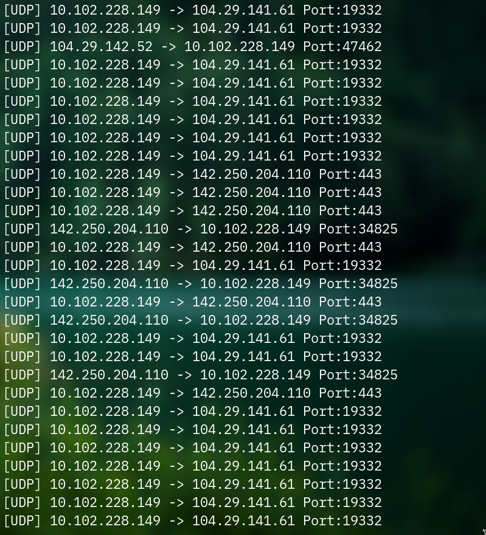

# Simple Raw Packet Sniffer (C)

A lightweight network traffic analyzer written in C from scratch. 
It uses Linux Raw Socket to capture and parse network frames at the Data Link layer.

## What does it do
* **Low-Level Access:** Captures raw binary data directly from the network driver.
* **Protocol Analysis:** Manually parses headers for:
    * **IP:** Source/Dest IP Addresses.
    * **TCP/UDP:** Dest Ports.
    * **ICMP:** Ping requests/replies.
* **Zero Dependencies:** Built using only standard Linux system libraries (`<netinet/*.h>`).

## Example Output


## How to Build & Run

### 1. Compile
You can compile the source code using `make`:
```bash
make
sudo ./sniffer
